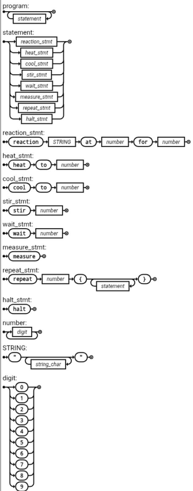

## ChemMic (`.chem`)

DSL para simulação de **reações químicas térmicas** usando a [MicrowaveVM](https://github.com/raulikeda/MicrowaveVM).  
Permite descrever processos laboratoriais simplificados — aquecimento, resfriamento, mistura e medição — através de comandos de alto nível compilados em instruções `.mwasm`.

---

### Construções (Elementos)

- `reaction "Nome" at <temp> for <time>`: executa uma reação mantendo a temperatura (`TEMP`) no valor alvo por determinado tempo (`TIME`).
- `heat to <temp>`: aumenta gradualmente a potência (`POWER`) até que `TEMP` atinja o valor desejado.
- `cool to <temp>`: aguarda o resfriamento natural até que `TEMP` seja menor ou igual ao valor indicado.
- `stir <n>`: simula agitação, alternando a potência entre valores altos e baixos `n` vezes.
- `wait <t>`: pausa a execução (POWER = 0) por `<t>` segundos simulados.
- `measure`: exibe o estado atual dos registradores (`TIME`, `POWER`, `TEMP`).
- `repeat <n> { ... }`: repete um bloco de comandos `<n>` vezes.
- `halt`: finaliza a simulação.

---



### Como Mapeia

- Cada `reaction` é convertida em um loop que mantém a potência até atingir a temperatura desejada (`TEMP ≥ alvo`), e depois decrementa `TIME` até zero.
- `heat` e `cool` usam loops que ajustam `POWER` com base nas leituras do sensor `TEMP`.
- `stir` alterna `POWER` entre 0 e o último valor ativo, simulando a mistura do reagente.
- `measure` traduz para instruções `PRINT`, exibindo valores dos registradores.
- `repeat` é implementado com rótulos (`labels`) e `DECJZ` para controle de iteração.
- A **MicrowaveVM** atualiza `TEMP` automaticamente a cada instrução:

- O programa termina com `HALT` automático, se não declarado explicitamente.

---

### Exemplo

```text
reaction "Evaporation" at 80 for 15
stir 3
cool to 40
reaction "Crystallization" at 60 for 10
measure
halt

; Reaction: Evaporation
SET POWER 100
SET TIME 15
evap_loop:
  DECJZ TIME evap_end
  GOTO evap_loop
evap_end:

; Stirring
stir_loop:
  SET POWER 0
  INC TIME
  SET POWER 60
  INC TIME
  DECJZ TIME stir_end
  GOTO stir_loop
stir_end:

; Cooling
SET POWER 0
cool_loop:
  ; Aguarda TEMP <= 40
  GOTO cool_loop

; Crystallization
SET POWER 60
SET TIME 10
cryst_loop:
  DECJZ TIME cryst_end
  GOTO cryst_loop
cryst_end:

PRINT
HALT
```


## Execução
```bash
make
make run
```


